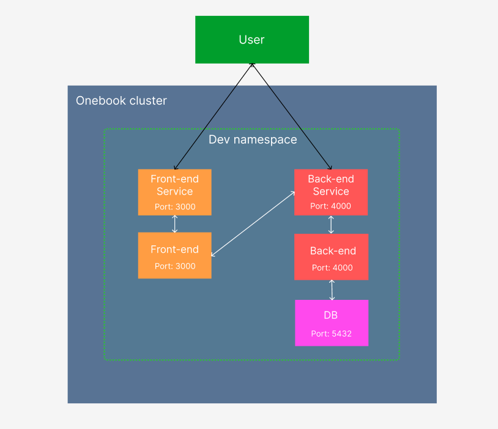

# OneBook Back-end

**Onebook** is a website allowing artists to publish their work and create their online "book".

## Run Locally

> `Before running the command`: The database must be started and the env variables must be defined in the _.env_ file.

```
npm run dev
```

### Environment Variables

Create a _.env_ file and fill it with the following variables:

**`DB_URL`**

The database url to connect to.  
Example: _postgres://postgres:\<password>@127.0.0.1:5432/postgres_

**`JWT_SECRET_TOKEN`**

The secret token used to sign the JWT token.

**`CLOUDINARY_CLOUD_NAME`**

Your cloudinary cloud name.

**`CLOUDINARY_API_KEY`**

Your cloudinary api key.

**`CLOUDINARY_API_SECRET`**

Your cloudinary api secret.

## Run in a Kubernetes Development Cluster

### Prerequisites

- Kubernetes distribution (examples: _k3s_ or _minikube_)
- Kubectl CLI
- Docker

> In the following commands, only k3s is used.

### Start the application

1. create a new k3d cluster named _onebook_ and a _dev_ namespace

```bash
k3d cluster create onebook
kubectl create namespace dev
```

2. Build and test the onebook-backend image with _Docker_

```bash
docker build -t onebook-backend:dev .
docker run --rm --name onebook-backend -p 4000:4000 onebook-backend:dev

# access the application
curl http://localhost:4000

docker stop onebook-backend
```

3. Pull postgres image for the database

```bash
docker pull postgres:latest
```

4. Add your customs images to the k3d cluster

```bash
k3d image import onebook-backend:dev -c onebook
k3d image import postgres:latest -c onebook
```

5. Deploy the application

> `Before apply the infra-as-code files`: fill all \<variables> in Deployment files.

```bash
# start the database first
kubectl apply -f infra-as-code/DB_Deployment.yaml

kubectl apply -f infra-as-code/

# verify the deployment
kubectl get deployments -n dev

# verify the service and get its external IP
kubectl get services -n dev

# access the application
curl http://<service-external-ip>:4000
```

### Clean

To clean the Kubernetes dev namespace:

```bash
kubectl delete -f infra-as-code/
```

To remove the Kubernetes dev namespace:

```bash
kubectl delete namespace dev
```

## Schema of the global application


